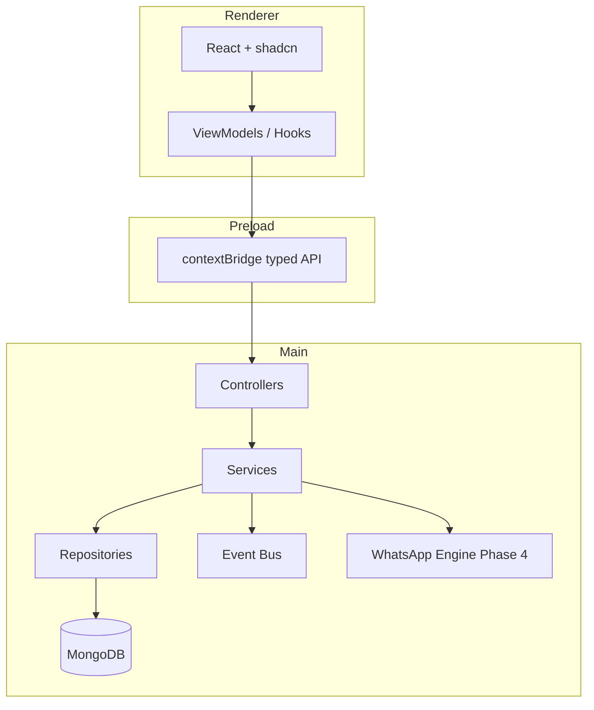

# Architecture

## Product scope

ShopFlow manages one company’s daily operations:

- **Orders** — retail counter and delivery
- **Products & customers** — catalog and contacts
- **Billing** — simple bill and GST invoice
- **Credit (udhaar)** — customer ledger and settlements
- **Stock** — optional per company and per product
- **Expenses** — daily feed with preset and custom categories
- **WhatsApp** — outbound bills/confirmations/reminders; inbound menu and staff inbox (Phase 4)

**Roles:** Admin, Staff (permission matrix in [BUSINESS-RULES.md](./BUSINESS-RULES.md)).

---

## No separate backend

MongoDB is accessed **only from the Electron main process** using the official Node driver and a connection URL (Atlas or local).

| Do | Don't |
|----|-------|
| Connect in `main/database/connection.ts` | Run Express/Fastify as app backend |
| Expose safe methods via preload `contextBridge` | Put `mongodb` driver in renderer |
| Store connection URL encrypted in main | Ship MongoDB URL in renderer bundle |
| Use IPC invoke/handle for all data ops | Call `fetch('http://localhost:…')` for own DB |

Future Flutter clients may add an optional sync API; repositories and services must stay reusable without coupling to Electron IPC.

---

## MVC mapping

| MVC | Location | Responsibility |
|-----|----------|----------------|
| **Model** | `main/models/`, `main/repositories/` | Schemas, types, MongoDB CRUD |
| **View** | `renderer/src/pages/`, `components/` | UI only — shadcn, no DB |
| **Controller** | `main/controllers/` (IPC), `renderer/viewmodels/` (UI actions) | Request handling, orchestration entry |

### Request flow

```
View (React)
  → ViewModel / hook
  → window.api.* (preload)
  → Controller (ipcMain.handle)
  → Service (validation, rules)
  → Repository (MongoDB)
  → Event bus (optional notify)
  → webContents.send → renderer update
```

**Controllers stay thin.** Business rules live in services. Repositories only touch the database.

---

## Process split



---

## IPC design

- Channel names live in `shared/ipc-channels.ts` (single source of truth).
- Pattern: `domain:action` — e.g. `settings:save`, `orders:create`.
- Preload exposes grouped APIs: `window.api.settings`, `window.api.database`, etc.
- All handlers wrap errors via `main/helpers/error-handler.ts` — never leak stack traces to UI.

---

## Event bus

Separate domain events from IPC:

| Domain | Examples |
|--------|----------|
| `app.*` | `app.ready`, `app.quit` |
| `db.*` | `db.connected`, `db.disconnected`, `db.error` |
| `settings.*` | `settings.updated` |
| `whatsapp.*` | `whatsapp.message.in`, `whatsapp.session.ready` (Phase 4) |

Services **emit** events; controllers or dedicated listeners forward to renderer when needed.

Implementation: `main/events/event-bus.ts` (EventEmitter or `mitt`).

---

## Security defaults (Electron)

- `contextIsolation: true`
- `nodeIntegration: false` in renderer
- Preload is the only bridge
- Single-instance lock for shop PC
- Secrets via `safeStorage` / encrypted local store in main
- CSP configured for production build

---

## Production tooling

- **Dev/build:** electron-vite (recommended)
- **Packaging:** electron-builder (`.dmg`, `.exe`)
- **Logging:** electron-log with rotation under `userData`
- **Schema version:** `app_meta.schemaVersion` in MongoDB for migrations

---

## Flutter future

Keep boundaries:

```
repositories/  → data access only
services/      → business rules
controllers/   → Electron IPC today; HTTP handlers tomorrow if needed
```

Flutter becomes another client; do not duplicate business logic in Dart when an API is added later.
