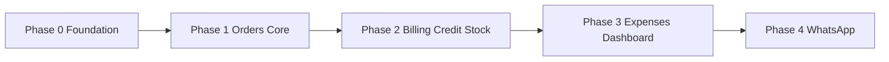

# Development Phases

Strict scope boundaries. Do not merge phase work — finish exit criteria before moving on.

---

## Phase 0 — Foundation

**Goal:** Production-ready shell with MongoDB URL connectivity. **No business logic.**

### Exit criteria

- [x] App installs and runs on target OS
- [x] First-run wizard saves MongoDB URL and connects
- [x] Settings show connection health
- [x] Sidebar navigation works; pages are placeholders
- [x] All data access goes through IPC → main → repository pattern (even if only settings)

---

## Phase 1 — Core business ✅

- Company settings (name, GSTIN placeholder)
- Users: Admin / Staff with real login
- Products CRUD
- Customers CRUD (phone, address, GSTIN)
- Orders: retail + delivery, line items, status flow
- Order list and detail views

**Not yet:** PDF bills, WhatsApp, expenses, stock deduction.

---

## Phase 2 — Billing, credit, stock ✅

- Simple bill + GST invoice PDF generation
- Invoice numbering series
- Customer credit ledger (debit/credit, balance)
- Payment: paid / partial / credit on order
- Stock tracking: company toggle + per-product optional; order confirm may deduct stock

---

## Phase 3 — Expenses & dashboard ✅

- Expense categories (Admin)
- Daily expense feed + custom category entries
- Dashboard: today orders, expenses, rough net
- Reports: basic sales and expense summaries

---

## Phase 4 — WhatsApp ✅

- Baileys session in main process (separate module)
- Outbound: bill PDF, order confirm, delivery update
- Anti-ban queue and rate limits (see [WHATSAPP.md](./WHATSAPP.md))
- Admin menu builder (numbered text menu)
- Inbound routing + multi-staff sorted inbox
- Conversation assignment, lock, takeover

---

## Phase map

WhatsApp is intentionally last so orders and billing are stable before messaging risk.
