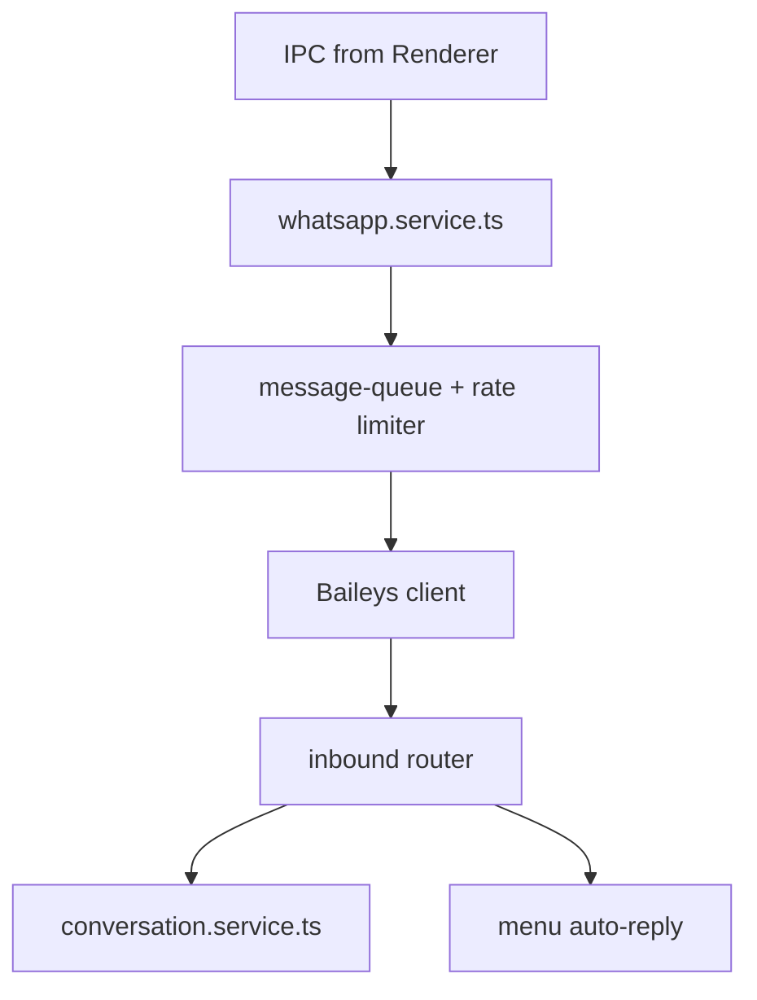

# WhatsApp Module (Phase 4)

Baileys runs in **Electron main process** only (`main/whatsapp/`). Renderer uses IPC for send, inbox, and session QR.

**Risk:** Unofficial API — design for anti-ban and future swap to WhatsApp Business API via provider interface.

---

## Capabilities

| Feature | Description |
|---------|-------------|
| Outbound bill | PDF/image from order |
| Order confirm | Template after order confirmed |
| Delivery update | Status message on delivery flow |
| Reminders | Credit balance / follow-up — **Admin approve queue** |
| Menu | Admin-built numbered text menu |
| Inbox | Multi-customer, multi-staff sorted conversations |

---

## Architecture



Provider interface: `WhatsAppProvider` — `BaileysProvider` now, official API later.

---

## Anti-ban system

Hard limits enforced in code (defaults in `anti_ban_config`, Admin can tune):

| Rule | Default |
|------|---------|
| Max messages / minute | 3–5 |
| Max messages / hour | 30–50 |
| Min gap same customer | 2–5 min |
| Bulk / reminders | Queue + Admin approve |
| Identical text burst | Block — require variable substitution |

### Behaviors

- Template variables: `{customerName}`, `{orderNo}`, `{amount}`
- Auto-pause outbound if failure rate spikes
- Exponential backoff on retry — no tight retry loops
- Dedicated business number; warm-up period for new numbers
- Log every send in `whatsapp_logs`

---

## Menu (Admin)

Numbered text menu example:

```
Welcome to {shopName}
1. Price list
2. Place order
3. My balance
4. Last bill
5. Talk to staff
Reply with a number.
```

Actions: `send_text`, `send_pdf`, `open_staff_queue`, `trigger_flow`.

Keywords: `menu`, `bill`, `order` map to same router.

---

## Inbox — multi-staff

### Conversation states

`open` | `assigned` | `waiting_customer` | `closed`

### Sort priority

1. Unassigned + unread
2. Assigned to me + unread
3. Waiting customer (follow-up due)
4. Recent `lastMessageAt`

### Assignment

- Round-robin to staff (configurable)
- Manual assign / takeover (Admin)
- **Lock:** one active replier per conversation — others see read-only or "Staff X is typing"

### Business links

- Open customer by phone match
- Create order from conversation

---

## IPC domains (Phase 4)

- `whatsapp:session-status`
- `whatsapp:connect` / `disconnect`
- `whatsapp:send-bill`
- `whatsapp:send-template`
- `whatsapp:inbox-list`
- `whatsapp:assign-conversation`
- `whatsapp:reply`
- `whatsapp:menu-get` / `menu-save` (Admin)

Channel names must be registered in `shared/ipc-channels.ts`.
